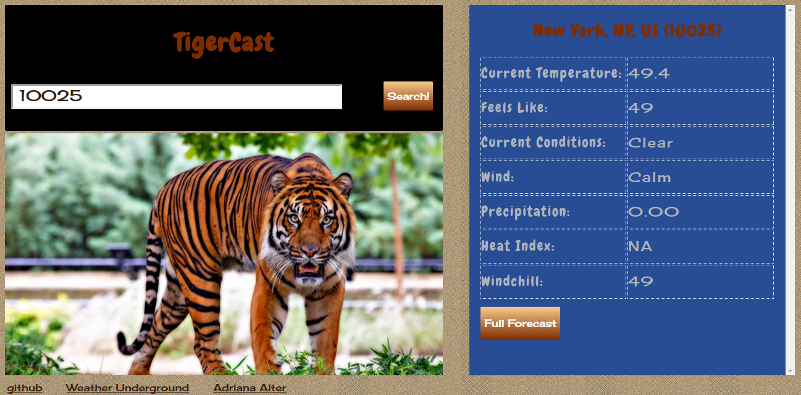

#TigerCast

<a href="https://adrianaalter.github.io/TigerCast/">TigerCast</a> is a weather app which gives you a picture of a tiger along with your forecast!  It is written in JavaScript, and uses jQuery AJAX requests to pull weather data from the Weather Underground API.  Just type in your zipcode, and TigerCast will retrieve your current conditions, your ten-day forecast, and a tiger whose weather matches yours.  TigerCast uses CSS3 media queries and the HTML5 viewport attribute for full responsiveness.

<a href="https://adrianaalter.github.io/TigerCast/"></img></a>
